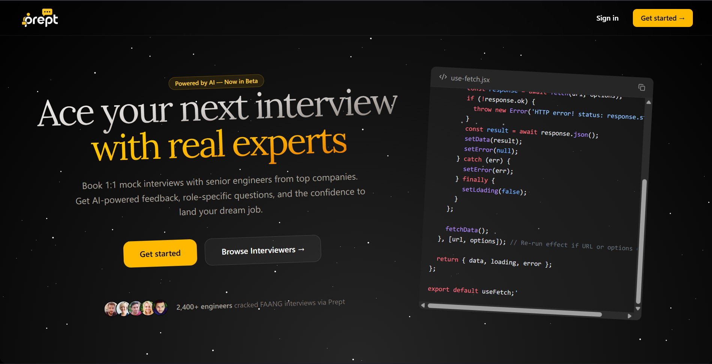

# Prept 🎯

An AI-powered Interview Marketplace SaaS platform that connects interviewees with experienced professionals for mock interviews, real-time feedback, and career preparation.

Built with Next.js, Prisma, PostgreSQL, Clerk Authentication, Gemini AI, Stream Video SDK, Arcjet, and Tailwind CSS.



---

## Live Demo

https://your-vercel-url.vercel.app/

---

## Overview

Prept is a full-stack Interview Marketplace platform designed to help candidates prepare for technical and behavioral interviews through one-on-one mock interview sessions with industry professionals.

The platform combines AI-generated interview questions, real-time HD video calls, automated feedback reports, secure booking workflows, role-based dashboards, and a credit-based marketplace system.

Inspired by modern marketplaces such as Topmate, Interviewing.io, and Pramp.

---

## Screenshots

### Landing Page


### Explore Interviewers


### Interview Session


### Interviewer Dashboard


### AI Feedback Report


---

## Why I Built This

Interview preparation often lacks personalized feedback and realistic interview experiences.

I wanted to build a platform where candidates could:

* Connect with experienced interviewers
* Practice real interview scenarios
* Receive detailed AI-generated feedback
* Improve interview performance through structured mock sessions

This project demonstrates:

* Full-stack SaaS architecture
* AI-powered workflows
* Real-time communication systems
* Role-based access control
* Marketplace design patterns
* Credit-based transaction systems
* Secure application development

---

## Features

### Role-Based Onboarding

* Join as Interviewee or Interviewer
* Profile creation and specialization setup
* Experience and company information
* Domain-specific expertise selection

### Interview Marketplace

* Browse available interviewers
* Filter by category and expertise
* View interviewer profiles
* Book one-on-one mock interviews

### AI Question Generator

* Gemini-powered interview questions
* Domain-specific question generation
* Real-time interviewer assistance
* Dynamic interview support

### AI Feedback Reports

* Automated performance evaluation
* Technical assessment feedback
* Communication analysis
* Strengths and improvement recommendations

### Real-Time Communication

* HD video calls using Stream
* Persistent chat functionality
* Secure interview sessions
* Seamless user experience

### Credit-Based Marketplace

* Free Plan: 1 Credit
* Starter Plan: 5 Credits
* Pro Plan: 15 Credits
* One credit per booked session
* Server-side credit validation

### Interviewer Dashboard

* Earnings tracking
* Credit balance management
* Session analytics
* Availability scheduling
* Withdrawal request management

### Booking Management

* Availability-based scheduling
* Session confirmations
* Appointment tracking
* Booking history

### Security & Protection

* Arcjet rate limiting
* Bot protection
* OWASP security safeguards
* Protected API routes
* Secure authentication

---

## Tech Stack

### Frontend

* Next.js 15
* React
* JavaScript
* Tailwind CSS
* Shadcn UI
* Framer Motion

### Backend

* Next.js Server Actions
* Prisma ORM
* PostgreSQL

### AI

* Google Gemini AI

### Authentication

* Clerk

### Real-Time Communication

* Stream Video SDK
* Stream Chat

### Security

* Arcjet

### Infrastructure

* Vercel Deployment

---

## Architecture

```text
Interviewee
      │
      ▼
Browse Marketplace
      │
      ▼
Book Interview Session
      │
      ▼
Stream Video Call
      │
      ▼
AI Question Generation
      │
      ▼
Interview Completion
      │
      ▼
AI Feedback Report
```

---

## Getting Started

### Prerequisites

* Node.js 22+
* PostgreSQL Database
* Clerk Account
* Stream Account
* Google AI Studio API Key

### Installation

Clone the repository:

```bash
git clone https://github.com/YOUR_USERNAME/prept.git
cd prept
```

Install dependencies:

```bash
npm install
```

Generate Prisma Client:

```bash
npx prisma generate
```

Push database schema:

```bash
npx prisma db push
```

Start development server:

```bash
npm run dev
```

Open:

```text
http://localhost:3000
```

---

## Environment Variables

Create a `.env.local` file:

```env
# Database
DATABASE_URL=

# Clerk
NEXT_PUBLIC_CLERK_PUBLISHABLE_KEY=
CLERK_SECRET_KEY=

# Gemini AI
GOOGLE_API_KEY=

# Stream
NEXT_PUBLIC_STREAM_API_KEY=
STREAM_SECRET_KEY=

# Arcjet
ARCJET_KEY=

# Resend
RESEND_API_KEY=

# Application
NEXT_PUBLIC_APP_URL=
```

---

## Database Schema

### User

```text
id
clerkUserId
email
name
imageUrl
role
credits
currentPlan
creditBalance
createdAt
updatedAt
```

### Booking

```text
id
intervieweeId
interviewerId
startTime
endTime
status
creditsCharged
createdAt
updatedAt
```

### Availability

```text
id
interviewerId
startTime
endTime
status
```

### Feedback

```text
id
bookingId
summary
technical
communication
problemSolving
recommendation
overallRating
```

---

## Key Technical Challenges

### Real-Time Video Communication

Integrated Stream Video SDK to provide reliable HD interview sessions with real-time communication features.

### AI Feedback Generation

Built AI-powered workflows using Gemini to generate detailed interview evaluations and actionable recommendations.

### Marketplace Architecture

Implemented role-based onboarding, booking workflows, availability management, and interviewer discovery.

### Credit Transaction System

Designed a secure credit-based marketplace where interviewees spend credits and interviewers earn credits through completed sessions.

### Security Implementation

Integrated Arcjet protection with rate limiting, bot detection, and API safeguards to secure platform interactions.

---

## Future Improvements

* Resume analysis
* AI-generated interview roadmaps
* Multi-language interview support
* Group mock interviews
* Stripe payment integration
* Interview recording playback
* Interviewer ratings and reviews
* Calendar synchronization

---

## Deployment

Frontend & Backend:

* Vercel

Database:

* PostgreSQL

Authentication:

* Clerk

Video Infrastructure:

* Stream

AI Services:

* Google Gemini

---

## Author

### Yashwardhan Soni

Full Stack Developer

GitHub:
https://github.com/yashsoni978

---

## License

This project is licensed under the MIT License.

---

## Support

If you found this project useful, consider giving it a ⭐ on GitHub.

